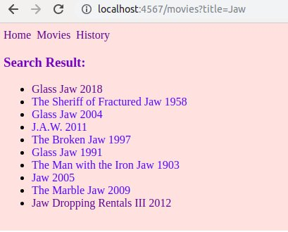

##About the app

###Summary

The students will update their movies app to allow users to search the database of movies.

###Specification

Instead of returning a single title, the OMDb API allows you to do a search which will return multiple titles. Look up the documentation on http://omdbapi.com to find out how to do that.

For example if you search for Jaws, you will get a list like the following:

Jaws
Jaws 2
Jaws 3-D
Jaws Special
Jaws Wired Shut
Update your app to allow users to enter a search for movies, and to show the list as a set of links. Users should then be able to click on the link and go to the movie-etails page (like in your existing app).

Extra credit:
Consider updating the search functionality so that if you just get one movie back - you don't show the list but take the user straight to the page that shows the information (fewer clicks makes for better user experience).

Extra extra credit:
Everytime a user does a search save the movie searched into a file called search_history.txt

add an extra path '/history' that list out all search history

##ScreenShot

##Struggles

###For this  movie app,I came across the following problems

####1 how to created a list of a tag inside erb file

####solution:
option 1 we could use the array in main.rb and join each element with the a tag surround it like

titles =[title1, title2]

str =''
titles.each do |title|
  str = str + "<a href="">#{title}</a>"

option 2 do it inside the erb file

whatever the ruby expression goes into the  <% %> and for @var don't forget the equal  <%= @var_name %>

####2 with the searching result link, I first pass in title to get the information, however, there are movies with exactly same title but in different years. the title is not unique 

####solution: get imbID instead, this id is unique so you get diferent information with same title 

####3 url encoder

I get stuck with redirect syntax the space inside a url for I accidentally put space inside the url which break the whole redirect method

####solution
it is always good to put url encoder for all url 

####4 main.css didn't get update
#### solution
inside the google developer tool in network tick disable cache
